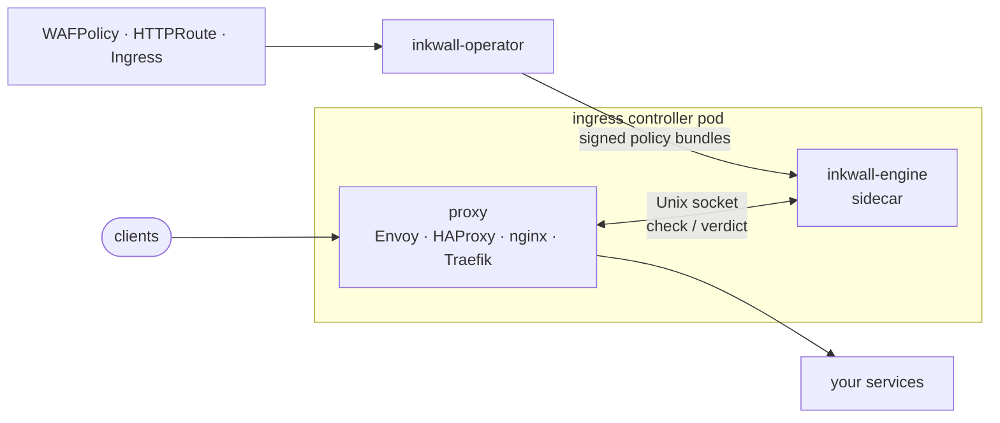

# Inkwall

**A Kubernetes-native web application firewall. Install one operator, and every ingress and gateway
in your cluster is protected by the same policy.**

> **Status: design phase.** No release exists yet. The architecture is written up in
> [`docs/design`](docs/design/README.md) and the engine is the first thing being built. Everything
> below describes the target, not shipped features.

---

## Why Inkwall

Running a WAF in Kubernetes today means picking one per proxy: ModSecurity for ingress-nginx, a
plugin for Traefik, a WASM filter for Envoy, an SPOA agent for HAProxy, each with its own config,
rules, and failure modes. Change your ingress, and you rebuild your WAF.

Inkwall makes the WAF a Kubernetes primitive, the way cert-manager did for TLS:

- **One policy, every proxy.** Write a `WAFPolicy` against an `Ingress` or `HTTPRoute`. The
  operator discovers which controller serves it and wires the engine in using that proxy's native
  hook.
- **Standard rules.** Built on [OWASP Coraza](https://coraza.io/) and the
  [OWASP Core Rule Set](https://coreruleset.org/). Existing ModSecurity rules and exclusions keep
  working.
- **Fast by design.** The engine runs as a sidecar next to the proxy over a Unix socket (or
  in-process for Caddy), with tiered checks so most requests never touch a regex. Latency budgets are
  part of the design, and CI will fail on regressions.
- **Safe by default.** New routes start in detect mode (no added latency, no false-positive
  outages). Fail-open unless you choose otherwise. Policies are signed.
- **GitOps first, SaaS optional.** CRDs in Git are the source of truth. Everything enforces fully
  offline; an optional control plane adds fleet management and attack analytics.
- **A way off ingress-nginx.** Protect ingress-nginx today, move routes to a Gateway API
  implementation tomorrow, and keep the same policies.

## How it works



1. **`inkwall-operator`** watches your routes and `WAFPolicy` objects, injects the engine into your
   ingress controller pods, wires the proxy, and pushes signed policy bundles to every engine.
2. **`inkwall-engine`** answers each proxy's native protocol (Envoy `ext_proc`/`ext_authz`, HAProxy
   SPOE, forward-auth, a Lua plugin for ingress-nginx) and returns allow / deny in microseconds.
3. **Status** on each policy tells you how far it got: `Accepted` → `Programmed` → `Enforced`
   on every engine.

## Example

```yaml
apiVersion: waf.inkwall.dev/v1alpha1
kind: WAFPolicy
metadata:
  name: shop
  namespace: shop
spec:
  targetRefs:
  - group: gateway.networking.k8s.io
    kind: HTTPRoute
    name: shop-api
  mode: Detect            # switch to Block once false positives are tuned
  ruleSets:
  - ref: {kind: ClusterWAFRuleSet, name: owasp-crs-v4}
    paranoiaLevel: 1
  rateLimits:
  - name: login
    match: {path: /api/login, methods: [POST]}
    key: ClientIP
    limit: 10
    window: 1m
```

```console
$ kubectl get wafpolicy -n shop
NAME   MODE     READY   ENGINES   AGE
shop   Detect   True    3/3       2m
```

(Illustrative. The API is `v1alpha1` and will change.)

## Planned integrations

| Proxy / controller | Hook | Body inspection |
|---|---|---|
| Envoy, Envoy Gateway, Istio, Contour | `ext_proc` (or `ext_authz`) | streamed |
| HAProxy (both Kubernetes ingress controllers) | SPOE | yes |
| ingress-nginx | Lua plugin (or global auth URL) | yes (plugin) |
| Traefik | ForwardAuth, later a plugin | limited |
| Caddy | native module, in-process | yes |
| Anything else | standalone reverse proxy | yes |

## Roadmap

1. **Engine:** Coraza + CRS, tiered pipeline, standalone reverse-proxy mode, benchmark harness.
2. **Envoy integration** end to end on kind.
3. **HAProxy, ingress-nginx, Traefik, Caddy** integrations.
4. **Operator + Helm chart:** discovery, injection, wiring, signed bundles, status.
5. **Optional control plane:** multi-cluster policy management and attack analytics.

## Documentation

| Doc | What it covers |
|---|---|
| [Component map](docs/design/0005-component-map.md) | Start here: diagrams of every component, where it runs, why Coraza |
| [Performance-first architecture](docs/design/0001-performance-first-architecture.md) | Latency budgets, tiered pipeline, failure behaviour |
| [System architecture](docs/design/0002-system-architecture.md) | Engine, CRDs, protocols, per-proxy integration |
| [Kubernetes operator](docs/design/0004-operator.md) | Discovery, injection, wiring, bundles, status, uninstall |
| [Adapter protocols](docs/design/0006-adapter-protocols.md) | ext_authz, ext_proc, forward-auth, SPOE explained |

## Contributing

Contributions and design feedback are welcome. Read [CONTRIBUTING.md](CONTRIBUTING.md) for commit
conventions, branching, and releases.

## License

Inkwall is licensed under the [Apache License 2.0](LICENSE).
