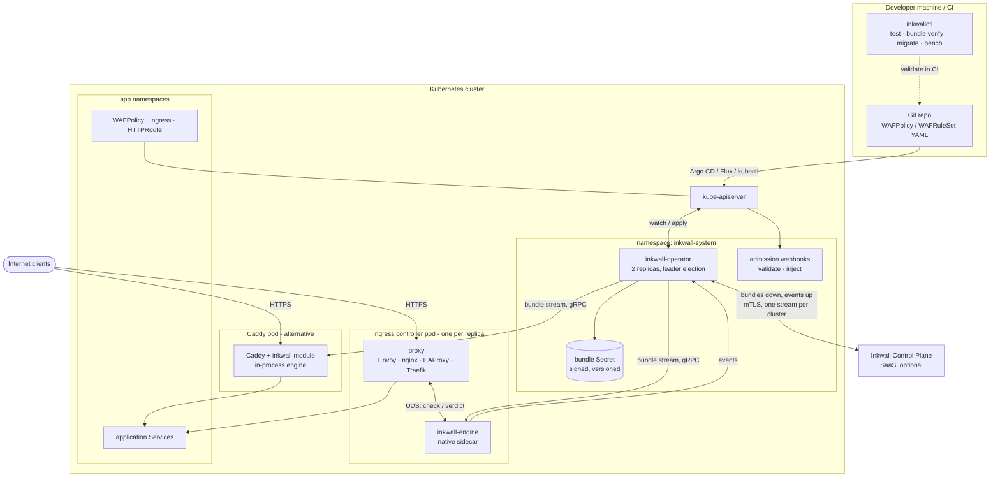
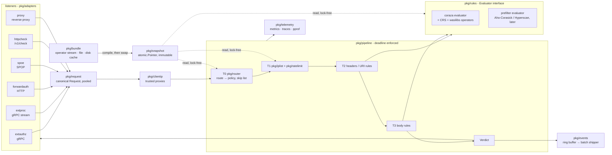
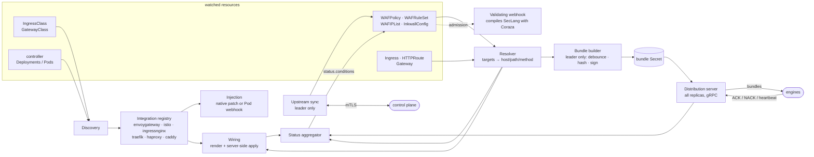
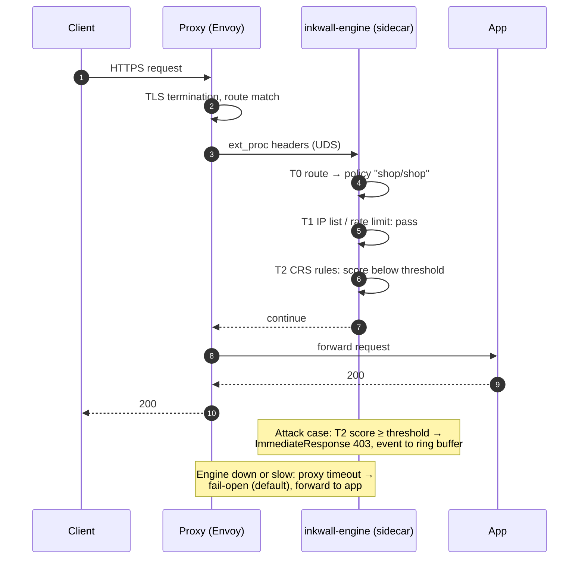
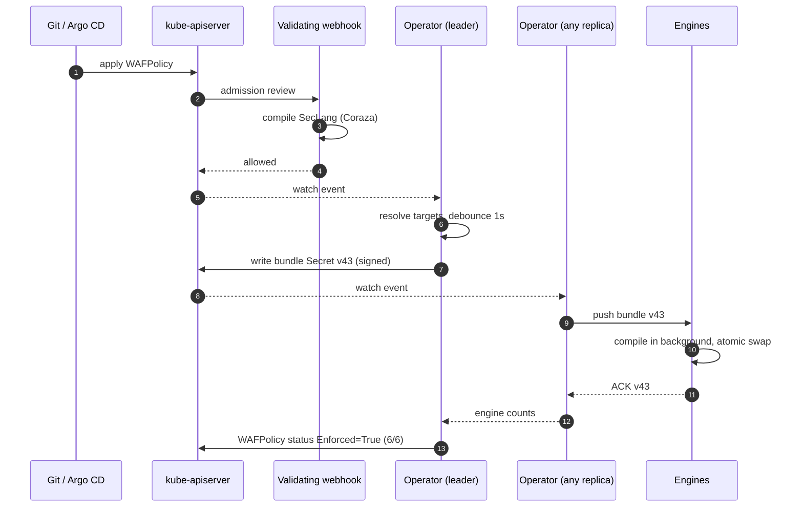

# 0005 — Component Map and Rule Engine Choice

- Status: Draft
- Date: 2026-09-27
- Owner: noureldin
- Depends on: [0002](0002-system-architecture.md), [0004](0004-operator.md)

Mermaid diagrams of every Inkwall component, where each one runs, and why the engine is built
on Coraza. GitHub renders Mermaid natively; locally use any Mermaid-aware Markdown preview.

---

## 1. Component overview

## 2. Where each component runs and when it is built

| Component | Runs in | Language / repo | Used by | License | Built in |
|---|---|---|---|---|---|
| **inkwall-engine** | Sidecar in ingress controller pods; or standalone Deployment; or reverse proxy on a VM | Go, `cmd/engine`, `pkg/` | Every protected request | Apache-2.0 | Stage 1 |
| **Engine adapters** (ext_authz, ext_proc, forward-auth, SPOE, `/v1/check`, reverse proxy) | Inside the engine process | Go, `pkg/adapters/*` | The proxy talking to the engine | Apache-2.0 | Stages 1-3 |
| **Proxy-side glue** (Lua plugin, SPOE config, Envoy filter config, Traefik Middleware) | Inside the proxy / its config | Lua, config templates, `adapters/nginx-lua`, `operator/integrations/*` | The proxy | Apache-2.0 | Stages 2-3 |
| **Caddy module** | Compiled into Caddy | Go, `adapters/caddy` (own go.mod) | Caddy users | Apache-2.0 | Stage 3 |
| **Traefik plugin** (thin client) | Inside Traefik (Yaegi) | Go, `adapters/traefik-plugin` (own go.mod) | Traefik users wanting per-route config | Apache-2.0 | Stage 3 (later) |
| **inkwall-operator** | `inkwall-system` namespace, 2 replicas | Go, `cmd/operator`, `operator/` | Platform teams; talks to kube-api, engines, SaaS | Apache-2.0 | Stage 4 (milestones O1-O5) |
| **Admission webhooks** | Inside the operator process | Go, `operator/webhook` | kube-apiserver on CRD writes and pod creation | Apache-2.0 | Stage 4 (O1, O4) |
| **CRDs** | kube-apiserver | YAML generated from `operator/api/v1alpha1` | App and platform teams | Apache-2.0 | Stage 4 (O1) |
| **Helm chart** | Installed by the user | `deploy/helm/inkwall` | Installation | Apache-2.0 | Stage 4 |
| **OLM bundle** | OperatorHub / OpenShift | generated by operator-sdk | OperatorHub installs | Apache-2.0 | Stage 6 |
| **inkwallctl** | Developer machine, CI | Go, `cmd/inkwallctl` | Developers, CI pipelines | Apache-2.0 | Stage 1 (`test`), later commands |
| **Protobuf APIs** (engine, agent, bundle) | Shared by engine, operator, control plane | `api/` (buf) | All components | Apache-2.0 | Stage 1 |
| **Control plane** (optional SaaS) | Inkwall-hosted cloud | separate product | SaaS customers | — | Stage 5 |

Rule of thumb: **everything inside the cluster is open source and works with no SaaS.** The SaaS
only adds management, analytics, and threat intel on top.

## 3. Engine internals

## 4. Operator internals

## 5. Key flows

### 5.1 Request in block mode

### 5.2 Policy change (GitOps mode)

---

## 6. Why Coraza

### 6.1 What a WAF rule engine must do

Detection is the hardest and most security-sensitive part of a WAF. A usable engine needs:

- a rule language (variables, operators, transformations, actions, chaining, phases),
- dozens of **transformations** that defeat evasion (`urlDecodeUni`, `htmlEntityDecode`,
  `normalizePath`, `removeNulls`, `lowercase`, `cmdLine`, ...),
- **body processors** for URL-encoded forms, multipart (file uploads), JSON and XML,
- **anomaly scoring**, persistent collections, and audit logging,
- a large, maintained **rule set** with a regression test suite.

Writing that from scratch is years of work, and every subtle parsing difference is a potential
bypass. That's the bar any choice has to clear.

### 6.2 Why Coraza fits

| Need | Coraza |
|---|---|
| Mature, standard rules | Implements the ModSecurity SecLang language and runs **OWASP CRS**, the de facto open rule set with its own regression tests. We get years of detection work on day one |
| Go-native | Pure Go, no cgo: static binaries, trivial cross-compilation, no C memory-safety bugs in the hot path, and it can run **in-process** (Caddy module) |
| Compatible with what users already run | Existing ModSecurity rules and CRS exclusions work, which gives ingress-nginx + ModSecurity users a migration path |
| License | Apache-2.0, same as Inkwall, and CRS is Apache-2.0 too |
| Community | OWASP project; already used for Caddy (`coraza-caddy`), HAProxy (`coraza-spoa`) and Envoy (`coraza-proxy-wasm`), so each integration idea is proven |
| Performance hooks | Build tags for multiphase evaluation (stop early), and pluggable operators (`coraza-wasilibs`: faster regex, Aho-Corasick, libinjection) |
| Reuse across components | The **same** library runs in the engine, in the operator's validating webhook (reject bad rules at `kubectl apply`), and in `inkwallctl test`, so all three always agree |

### 6.3 Alternatives considered

| Alternative | Why not (for now) |
|---|---|
| **Write our own engine** | Years of work before parity with CRS, high bypass risk, and users can't bring existing rules. Kept as a later option behind the `Evaluator` interface (the prefilter is the first step) |
| **libmodsecurity v3 via cgo** | C++ dependency: cgo call overhead on every request, harder builds and cross-compiles, C memory-safety bugs in-process. Trustwave ended its stewardship in 2024 and handed it to OWASP |
| **libinjection only** | Detects SQLi/XSS only; no rule language, no CRS coverage |
| **ML / signature-less detection** | Needs training data and a feedback loop we don't have yet; hard to explain verdicts. A possible later `Evaluator` |
| **Proprietary rule DSL** | Locks users in, and there are no rules to start from |

### 6.4 Risks and mitigations

| Risk | Mitigation |
|---|---|
| CRS evaluation is regex-heavy and can be slow | `coraza-wasilibs` operators, multiphase evaluation, tiered pipeline (most requests exit before rules), prefilter later, per-request deadline, benchmarks in CI (0001) |
| Dependency on a community project | Coraza stays behind `pkg/rules.Evaluator`; version pinned; go-ftw conformance tests catch behaviour changes on upgrade; contribute fixes upstream; fork only as a last resort |
| Coraza upgrade changes detection | CRS and Coraza versions pinned per Inkwall release (0002 §8.6) and exposed as a named builtin rule set |
| Go GC pauses with many transactions | Transaction pooling, `GOMEMLIMIT`, allocs/op gated in CI |

### 6.5 Where Coraza is used, and where it is not

| Component | Uses Coraza? | For |
|---|---|---|
| inkwall-engine (`pkg/rules/coraza`) | Yes | Evaluating T2 / T3 / T4 rules |
| Operator validating webhook | Yes | Compiling SecLang at admission |
| inkwallctl (`test`, `bundle verify`) | Yes | Local testing and CI validation |
| Caddy module | Yes (embeds the engine) | In-process evaluation |
| Adapters, router, IP lists, rate limiter | No | Inkwall's own code; these tiers run before rules |
| Traefik Yaegi plugin, nginx Lua plugin | No | Thin clients that call the engine |
| Control plane (optional) | For validation | Rejecting bad rules before they reach clusters |
