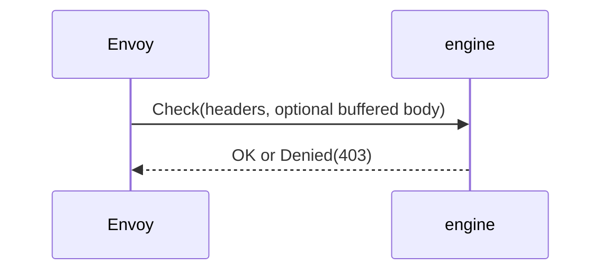
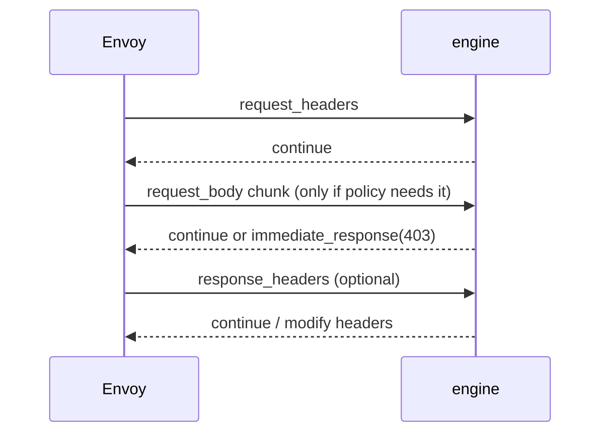
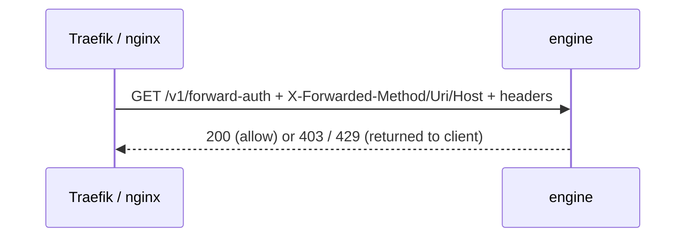
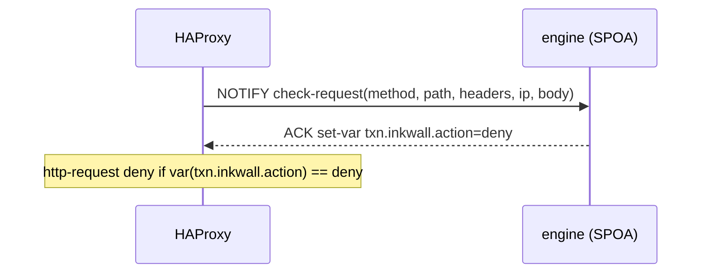
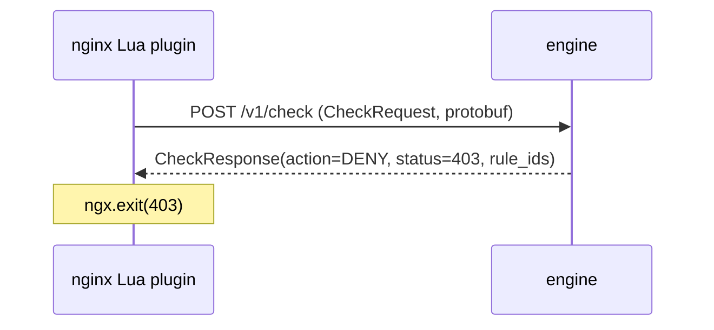
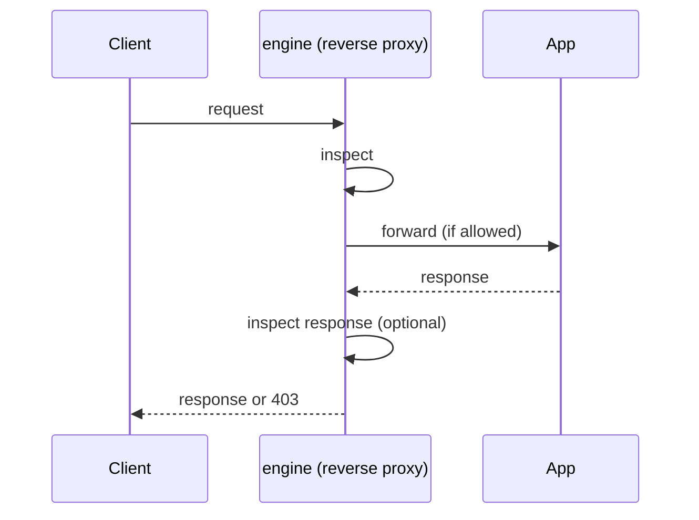

# 0006 — Adapter Protocols Primer

- Status: Draft
- Date: 2026-09-28
- Owner: noureldin
- Depends on: [0002](0002-system-architecture.md) §3.2 and §6

All six adapters answer the same question: **the proxy asking the engine "should I let this request
through?"** They differ in who defines the protocol, how much of the request is sent, and whether
the engine can see the body or the response.

In the engine, each one is a thin listener in `pkg/adapters/<name>`. It converts that protocol's
message into the canonical `request.Request` and converts our `Verdict` back into the protocol's
reply. Detection code is identical whichever proxy asked. Concrete proxy configuration for each
adapter is in 0002 §6.

---

## 1. ext_authz (Envoy external authorization)

- Envoy **pauses** the request and makes one gRPC call (`envoy.service.auth.v3.Authorization/Check`)
  containing the headers, plus the body if `with_request_body` buffering is configured.
- The engine replies **OK** (continue, optionally adding headers) or **Denied** (Envoy returns the
  status we choose, e.g. 403).
- One question, one answer. Never sees the response.
- Designed for authentication services (OAuth, API keys), so it is simple and supported by every
  Envoy-based product.

**Adapter:** `pkg/adapters/extauthz`. Used when `ext_proc` is unavailable or not wanted.

## 2. ext_proc (Envoy external processing)

- A **bidirectional gRPC stream** that stays open for the lifetime of the HTTP request.
- Envoy sends each stage as it happens: request headers → request body chunks → response headers →
  response body chunks. For each stage the engine answers **continue**, **modify** (add or remove
  headers, rewrite the body), or **immediate response** (block now).
- Envoy chooses per stage what to send (`processing_mode`), so we ask for headers only and turn on
  body stages only for routes whose policy needs them.
- **Observability mode** (`observability_mode: true`): Envoy sends the data but does not wait for
  our answer. This is how detect mode adds ~0 latency (0001 §4).
- The most capable of the six, and the reason Envoy is the first integration.

**Adapter:** `pkg/adapters/extproc`. Preferred for Envoy, Envoy Gateway, Istio, Contour.

## 3. forward-auth (Traefik `ForwardAuth`, nginx `auth_request`)

- Before forwarding, the proxy makes a **plain HTTP subrequest** to our URL with the original
  request's headers. The original method and URI arrive as headers (`X-Forwarded-Method`,
  `X-Forwarded-Uri`, `X-Forwarded-Host`, ...), and the adapter reconstructs the request from them.
- **2xx** → allow. Any other status → the proxy returns it to the client (403, 429, ...).
- Works with almost any proxy, but usually sends **headers only** (recent Traefik v3 versions can
  forward the body with `forwardBody`) and never the response.
- ingress-nginx `global-auth-url` uses this mechanism.

**Adapter:** `pkg/adapters/forwardauth`.

## 4. SPOE (HAProxy Stream Processing Offload Engine)

- HAProxy's own **binary protocol (SPOP)** for sending data to an external "agent" (SPOA). The
  engine implements the agent side.
- HAProxy sends a message with the fields its config lists (method, path, headers, source IP,
  body). We reply by **setting variables** such as `txn.inkwall.action=deny`, and HAProxy's own
  rules act on them (`http-request deny if { var(txn.inkwall.action) -m str deny }`).
- Many requests are pipelined over a few persistent connections, so it is very efficient.
- The engine never blocks directly: it sets variables and HAProxy config decides. If we time out or
  error, no variable is set, no deny rule matches, and the request passes (fail-open).
- Async groups allow detect mode without waiting.

**Adapter:** `pkg/adapters/spoe`.

## 5. `/v1/check` (Inkwall's own API)

- A simple endpoint we define: send a compact description of the request (`CheckRequest`,
  protobuf or JSON), get back a `CheckResponse` verdict (action, status, headers, matched rule IDs).
  Schema: 0002 §5.1.
- Exists for clients with no native protocol: the ingress-nginx **Lua plugin**, the **Traefik
  plugin**, `inkwallctl test`, and our tests.
- Because we own it, we control exactly what is sent and how compact it is.
- Served over HTTP (`POST /v1/check`) and gRPC (`CheckService/Check`), on the Unix socket in
  sidecar mode.

**Adapter:** `pkg/adapters/httpcheck`.

## 6. Reverse proxy (standalone mode)

- The engine **is** the proxy: clients connect to Inkwall, it inspects the request, then forwards
  it to the application itself. No other proxy is involved.
- Sees everything, including the full body and the response, at the cost of being an extra hop in
  the traffic path.
- Used for VMs, unsupported proxies, and as the **reference implementation** in tests: every other
  adapter must produce the same verdict as this one for the same request (adapter parity tests,
  0002 §10).

**Adapter:** `pkg/adapters/proxy`.

---

## 7. Comparison

| | Defined by | Transport | Body | Response | Waits for answer? | Used for |
|---|---|---|---|---|---|---|
| ext_authz | Envoy | gRPC, one call | buffered, optional | no | yes | Envoy fallback |
| ext_proc | Envoy | gRPC bidirectional stream | streamed | yes | yes, or no in observability mode | Envoy, Envoy Gateway, Istio, Contour |
| forward-auth | Traefik / nginx | HTTP subrequest | usually no | no | yes | Traefik, ingress-nginx fallback |
| SPOE | HAProxy | SPOP (binary, pipelined) | yes | possible | yes, or no with async groups | HAProxy |
| `/v1/check` | Inkwall | HTTP / gRPC | yes | no | yes | nginx Lua, Traefik plugin, CLI, tests |
| reverse proxy | Inkwall | full HTTP proxying | yes | yes | it is the traffic path | VMs, unsupported proxies, test reference |

Caddy is not listed: the engine is compiled into Caddy as a module and called as a Go function, so
there is no protocol at all (0002 §6.5).
