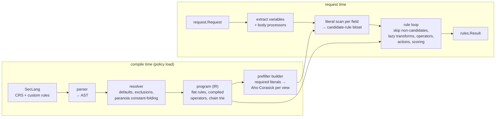

# 0007 — Inkwall Rule Engine

- Status: Draft
- Date: 2026-10-04
- Owner: noureldin
- Depends on: [0001](0001-performance-first-architecture.md) (budgets, measurements), [0002](0002-system-architecture.md) §3.1, [0005](0005-component-map.md) §6
- License: Apache-2.0, like the rest of the data plane

Inkwall's own rule engine, built to run the OWASP Core Rule Set (CRS) within the latency budgets of
0001, which the Coraza-based evaluator cannot reach. Coraza stays as the reference implementation
and as a fallback.

---

## 1. Summary

The engine compiles CRS (written in SecLang, the ModSecurity rule language) ahead of time into a
flat program and evaluates requests with three techniques Coraza's architecture rules out:

1. **One literal scan per field** selects the few rules that can possibly match; the rest are
   skipped before any transformation or regex runs.
2. **Lazy, shared transformations** without map lookups: a field is decoded only if a candidate
   rule needs it, and each result is reused by every rule that shares the transformation prefix.
3. **A zero-allocation, interruptible runtime**: pooled transactions, slices instead of maps, and a
   deadline check between rules, so a request can be abandoned without burning CPU.

Detection must be **identical** to Coraza's: same matched rule IDs, same anomaly scores, same
block decisions. That is verified against Coraza as an oracle and against the CRS regression suite
(4,572 tests) on every change.

Target: benign requests at 50–100 µs of engine time (5–10× faster than Coraza + CRS today).

## 2. Why

Measured in 0001 §3.1 and §5.2 (Coraza 3.8.1, CRS 4.25, paranoia level 1, one core):

| Request | Coraza today | Budget (0001 §3) |
|---|---|---|
| Benign GET | ~0.51 ms | ≤ 0.15 ms p50 (sidecar) |
| JSON, 150 fields | ~29 ms | ≤ 0.5 ms per 8 KB |

What limits Coraza, structurally:

- **Every rule runs on every field.** No candidate-rule selection exists; Coraza's per-rule regex
  prefilter misses attacks (CRS tests 942220-2, 932311-7) and is disabled.
- **Transformations run before the operator,** so even a skipped regex pays for decoding.
- **A map-based transformation cache** hashes a struct per rule per field (~25% of time).
- **~2,800 allocations per request,** driving ~14% GC time.
- **Evaluation cannot be interrupted,** which forced the admission-control workaround in the
  pipeline.

The feasibility measurement (`test/perf/prefilter`) showed that at paranoia level 1, 100 of the 104
per-argument CRS rules have a usable required literal, 90.5% of benign rule-field evaluations can
be skipped, and the literal extraction is sound under Unicode case folding (0 violations in about
2.1M checks, covering all 9,747 CRS test payloads and 13,314 Unicode fold variants).

Improving Coraza from outside covers only part of this (an `@rx` operator override saves operator
time, ~30%). The rest needs control of the rule loop.

## 3. Goals and non-goals

### Goals

1. Run CRS v4 (the version pinned per Inkwall release) with **detection parity** with Coraza: for
   every request, the same interruption decision and anomaly score, and — with early exit off
   (§4.2) — the same matched rule IDs. Parity includes Coraza's own deviations from ModSecurity;
   any deliberate difference (for example fixing a Coraza bug) is listed in a reviewed allowlist in
   the differential harness, with a reason and a test.
2. Meet the 0001 budgets for engine time, and keep allocations near zero.
3. Bound work per request: linear-time matching, size caps, and deadline checks between rules.
4. Implement `pkg/rules.Evaluator`, so adapters and the pipeline do not change.
5. Fall back to Coraza for rule sets that use features the engine does not support.

### Non-goals (v1)

- Full SecLang. The engine supports what pinned CRS uses, plus a documented subset for custom rules.
- Response inspection (phases 3–4) and audit logging (phase 5) — later, with tier T4.
- Being a general ModSecurity replacement outside Inkwall.

## 4. Architecture



Compilation happens once per policy bundle; the resulting program is immutable and shared by all
requests (0001 §5.1: atomic snapshot swap).

### 4.1 Compiler

1. **Parser.** SecLang directives into an AST, with file/line positions for errors. Unsupported
   directives, variables, operators, transformations or actions are compile errors that name the
   feature, so the pipeline can fall back to Coraza (§8).
2. **Resolver.**
   - Applies `SecDefaultAction`, configure-time exclusions (`SecRuleRemoveById`, `...ByTag`,
     `SecRuleUpdateTargetById`, `...ByTag`) and rule-group pruning.
   - **Constant-folds paranoia gating.** CRS skips rules at runtime with
     `skipAfter` markers that compare `tx.blocking_paranoia_level` and
     `tx.detection_paranoia_level`. In pinned CRS only the setup and initialization rules write
     those variables, so their values are fixed by configuration and rules above the configured
     level are removed from the program entirely. If any other rule writes them (for example a
     custom rule raising the paranoia level per path), folding is disabled for that program and
     the runtime gating is kept.
   - Resolves `skipAfter` targets to program indexes.
3. **IR (the program).** A flat, ordered slice of rules per phase. Each rule holds:
   - compiled variable selectors (collection, key/regex selector, exclusions, count `&`),
   - a **transformation chain ID** into a trie of all chains, so rules sharing a prefix share work,
   - a compiled operator (regex, Aho-Corasick set, numeric comparison, ...),
   - precompiled actions (`setvar` with macros compiled to templates, `ctl`, flow, disruptive),
   - chain links and its required-literal set (§4.3).
4. **Prefilter builder.** Extracts each rule's required literals (the algorithm validated in
   `test/perf/prefilter`: a literal set such that any match must contain one of them) and builds
   one Aho-Corasick automaton per normalization view (§4.3).

### 4.2 Runtime

- **Transaction** from a `sync.Pool`, reset per request; arena-style byte buffers; collections
  stored as slices of `(name, lowercased name, value, source)` — no maps on the hot path.
- **Variable extraction** once per phase: URI, query arguments, headers, cookies, then body
  arguments from the body processors.
- **Literal scan.** For each field and each view, one Aho-Corasick pass sets bits in a
  candidate-rule bitset (rules indexed 0..n).
- **Rule loop** in program order:
  1. resolve the rule's targets to fields;
  2. for a prefilterable rule, skip the field unless its candidate bit is set — no transformation,
     no operator;
  3. otherwise get the transformed value from the field's **memo slots indexed by chain-prefix
     ID** (no map hashing), computing missing steps. Slots are allocated lazily per field from the
     transaction's pool and capped per request, so a request with thousands of fields cannot make
     the memo table grow without bound;
  4. run the operator; on match, run actions (scoring, captures, `MATCHED_VAR*`, chain);
  5. check the context deadline every N rules — evaluation is **interruptible** between rules. A
     single operator call is not interrupted, so per-field size caps bound the longest step.
- **Early exit (block mode only, off by default):** once the inbound anomaly score reaches the
  threshold, the block is certain, and remaining rules may be skipped. It changes which rules are
  reported for blocked requests, so the differential harness, the CRS suite and shadow mode run
  with it off, and detect mode never uses it.
- **Body processors:** URL-encoded, JSON (Coraza-compatible flattened names such as
  `json.items.0.sku`), XML (for `XML:/*`), and multipart with the strict-validation flags CRS checks
  (`MULTIPART_STRICT_ERROR` and sub-flags, `REQBODY_ERROR`). Initially ported from Coraza
  (Apache-2.0, attributed) for parity, then optimized.
- **Regex:** Go's `regexp` (RE2 semantics, linear time — the same engine Coraza uses, so match
  semantics are identical), with Coraza's default `(?sm)` flags and `binaryregexp` for byte
  patterns. libinjection via `corazawaf/libinjection-go`.

### 4.3 Prefilter and normalization views

Literals must be checked against **transformed** values, but transformations are what we want to
avoid running. The engine resolves this with a small number of **normalization views** per field,
computed once each:

| View | Computed as | Covers rules whose chains use |
|---|---|---|
| `raw` | case-folded only, no decoding | chains without decoders (rules that look for encoded sequences such as `%u` or `\x` themselves) |
| `decoded` | URL-decode (incl. `%u`), HTML-entity decode, remove NULs, case-folded | chains made of these decoders and case changes |
| `cmdline` | `decoded` + `cmdLine` rules (drop `\ " ' ^`, `,;` → space) | `cmdLine` chains (RCE family) |
| `nospace` | `decoded` with all whitespace removed | `removeWhitespace` chains |
| `nocomments` | `decoded` with comments removed | `replaceComments` / `removeComments` chains |

Each rule is assigned the view that **dominates** its chain: for every input, if the rule's
transformed value contains a literal, the view also contains it. Domination is established per
chain by property tests and differential fuzzing; a chain with no proven dominating view falls back
to **post-transformation filtering** (literal check on the transformed value inside the loop —
still sound, saves only operator time).

Soundness rules that apply to every view:

- **Case folding, not lowercasing.** Go's `(?i)` matching uses Unicode case folding: `(?i)select`
  matches `ſelect` (U+017F, long s), but `strings.ToLower("ſelect")` does not contain `select`. A
  lowercase-based filter would skip a rule that matches. Views and literals are mapped to a
  canonical rune per fold orbit (consistent with `unicode.SimpleFold`), which is what the regex
  engine treats as equal.
- **No over-decoding.** A view must not decode more than the chain it covers: decoding destroys
  literals that a rule matches in encoded form. That is why `raw` exists, and why a chain that
  decodes twice (`urlDecodeUni,urlDecodeUni`) needs a view that does the same or falls back.
- **Rules that are never prefiltered:** negated operators (`!@rx` matches when the pattern is
  *absent*; none in pinned CRS target arguments, but custom rules may), `multiMatch` rules (the
  operator runs on every intermediate transformation; 8 rules in pinned CRS, in the 930, 934 and
  942 families) unless the view dominates every intermediate value, and operators whose match is
  not implied by a literal (numeric comparisons, `validate*`, libinjection, `within`).

This is the central design risk, so it is a milestone of its own (N3) with an explicit exit
criterion: zero soundness violations across the CRS payloads, the benign corpus, a Unicode corpus
(fold-orbit variants of every literal) and a fuzzing run.

The feasibility tool (`test/perf/prefilter`) already applies case folding and the fold-variant
corpus: 0 violations in about 2.1M checks at PL1 and 3.9M at PL4, while the lowercase method it
replaced fails on 2 rules at PL1 and 5 at PL4 (for example `;BAſE64` against rule 932260,
`@@VERſION` against 942480). Skip rates are unchanged by the fix (90.5% of benign evaluations, 72%
of operator time at PL1).

### 4.4 Supported SecLang subset

The pinned CRS defines the minimum. A CI check parses the pinned CRS with the engine's parser and
fails if anything is unsupported, so a CRS upgrade cannot silently lose rules. The table below is
indicative; the CI check produces the authoritative list in N0.

| Area | v1 support |
|---|---|
| Directives | `SecRule`, `SecAction`, `SecMarker`, `SecDefaultAction`, `SecRuleRemoveById/ByTag`, `SecRuleUpdateTargetById/ByTag`, `SecComponentSignature` (ignored), body-related config used by Inkwall |
| Variables | `ARGS*`, `ARGS_NAMES*`, `ARGS_COMBINED_SIZE`, `REQUEST_HEADERS*`, `REQUEST_HEADERS_NAMES`, `REQUEST_COOKIES*`, `REQUEST_COOKIES_NAMES`, `REQUEST_URI(_RAW)`, `REQUEST_FILENAME`, `REQUEST_BASENAME`, `REQUEST_LINE`, `REQUEST_METHOD`, `REQUEST_PROTOCOL`, `QUERY_STRING`, `REQUEST_BODY(_LENGTH)`, `FILES*`, `FILES_COMBINED_SIZE`, `MULTIPART_*`, `REQBODY_ERROR*`, `XML:/*`, `TX`, `MATCHED_VAR(S)(_NAME(S))`, `UNIQUE_ID`, `REMOTE_ADDR`, `&` counts, `:key` and `:/regex/` selectors, `!` exclusions |
| Operators | `rx`, `pm`, `pmFromFile`/`pmf`, `streq`, `contains`, `beginsWith`, `endsWith`, `within`, `eq`/`ge`/`gt`/`le`/`lt`, `ipMatch(FromFile)`, `validateByteRange`, `validateUrlEncoding`, `validateUtf8Encoding`, `detectSQLi`, `detectXSS`, `unconditionalMatch`, negation `!` |
| Transformations | about 25: `none`, `lowercase`, `urlDecode`, `urlDecodeUni`, `htmlEntityDecode`, `jsDecode`, `cssDecode`, `cmdLine`, `compressWhitespace`, `removeWhitespace`, `removeNulls`, `replaceNulls`, `removeComments`, `replaceComments`, `normalizePath`, `normalizePathWin`, `utf8toUnicode`, `base64Decode`, `base64DecodeExt`, `hexDecode`, `sqlHexDecode`, `escapeSeqDecode`, `length`, `trim`, `trimLeft`, `trimRight` (final list from the CI check) |
| Actions | `id`, `phase`, `msg`, `logdata`, `tag`, `severity`, `ver`, `t:`, `chain`, `block`, `deny`, `pass`, `allow`, `drop`, `status`, `setvar`, `capture`, `multiMatch`, `skipAfter`, `log`/`nolog`, `auditlog`/`noauditlog`, `ctl:ruleRemoveById`, `ctl:ruleRemoveByTag`, `ctl:ruleRemoveTargetById`, `ctl:ruleRemoveTargetByTag`, `ctl:requestBodyProcessor`, `ctl:ruleEngine`, `ctl:forceRequestBodyVariable`; metadata (`rev`, `maturity`, `accuracy`) parsed and ignored |

## 5. Verification

Detection parity is the product. Four independent checks:

1. **CRS regression suite** (`test/crs`) runs against both evaluators; the engine must pass the
   same 4,572 tests as Coraza.
2. **Differential testing against Coraza** (`test/diff`): the same requests through both
   evaluators must yield the same matched rule IDs, scores and interruption. Corpora: the CRS
   payloads, the benign corpus, recorded traffic samples, and **differential fuzzing** with Go's
   native fuzzer generating requests.
3. **Component conformance:** each transformation and body processor is fuzzed against Coraza's
   output (obtained through rules that capture the transformed value), byte for byte.
4. **Shadow mode in production:** the pipeline can run both evaluators on a sampled share of
   traffic and export `inkwall_engine_disagreements_total{rule_id}`; the engine is enabled for a
   policy only after a clean shadow period. The shadow evaluation runs off the request path, uses
   its own small slot budget, and is dropped first under load, so it never affects latency or
   admission control.

Plus the prefilter soundness check from `test/perf/prefilter`, run in CI against the compiled
program.

## 6. Performance targets

Engine time, single core, CRS paranoia level 1, gated in CI with `benchstat` (0001 §8):

| Request | Target | Coraza today |
|---|---|---|
| Benign GET | ≤ 100 µs p50 | ~510 µs |
| Benign form POST, 2 fields | ≤ 120 µs | ~740 µs |
| JSON, 150 fields | ≤ 3 ms | ~29 ms |
| Allocations, benign GET | ≤ 50 | ~2,800 |

Attack requests may cost more (candidate rules run in full), which is acceptable: they are rare,
and admission control bounds their impact.

These targets are provisional. The feasibility measurement covered only the 104 per-argument rules;
the rules that inspect headers, the URI and protocol details (the 920/921 families) also contribute
to the benign-GET cost and were not measured. N0 measures their share, and the targets are
confirmed or revised at the end of N3.

## 7. Integration

- New package `pkg/rules/native` implementing `rules.Evaluator`; `pkg/rules/coraza` stays.
- Policy option `engine: native | coraza | auto` (flag `--engine` in standalone mode). `auto`
  compiles with the engine and falls back to Coraza, with a logged reason, if the rule set uses an
  unsupported feature.
- Shadow mode: `--engine-shadow coraza --shadow-sample 0.01` evaluates a sample with both and
  reports disagreements (never affects the verdict).
- Default stays `coraza` until milestone N5's exit criteria are met; then `auto`.

## 8. Code layout

```
pkg/rules/native/
├── seclang/      # lexer, parser, AST, positions, errors
├── compile/      # resolver, paranoia folding, exclusions, IR builder
├── program/      # IR types, chain trie, skipAfter resolution
├── prefilter/    # literal extraction, views, Aho-Corasick, candidate bitsets
├── transform/    # transformations
├── operators/    # operators
├── bodyproc/     # urlencoded, json, xml, multipart
├── runtime/      # transaction, collections, rule loop, actions, scoring
└── evaluator.go  # rules.Evaluator implementation
test/diff/        # differential harness and fuzzers (separate module, imports Coraza)
```

Code ported from Coraza keeps its copyright header and is listed in a `NOTICE` file.

**Repository.** The engine starts inside the `inkwall` repo: during development it changes together
with the pipeline, the CRS suite and the differential harness, and one repo and one CI keep that
fast. `pkg/rules/native` must not import other Inkwall packages except `pkg/request` and
`pkg/rules` (enforced with golangci-lint's `depguard`), so it can later move to its own repository and Go module
(for example `github.com/inkwall-dev/engine`) once its API is stable and other projects want to
use it, the way Coraza is used today.

**Relationship to Coraza.** The engine replaces Coraza as the default evaluator after milestone N5.
Coraza is not removed: it remains the oracle for differential testing and the fallback for rule
sets that use SecLang features the engine does not support.

## 9. Milestones

| # | Milestone | Exit criteria |
|---|---|---|
| N0 | Parser + IR for pinned CRS, no execution | CI check: 100% of pinned CRS parses and compiles; paranoia folding verified |
| N1 | Transformations and operators | Byte-for-byte conformance fuzzing against Coraza for every one |
| N2 | Runtime, phases 1–2, no prefilter, URL-encoded bodies | CRS suite passes at PL1 on GET/form tests; differential tests clean |
| N3 | Prefilter, views, lazy transforms | 0 soundness violations; PL1 targets of §6 met for GET and form |
| N4 | JSON, XML, multipart body processors | Full CRS suite passes (all request tests); JSON target met |
| N5 | Integration: `--engine`, `auto` fallback, shadow mode | A clean shadow period on real traffic; default switches to `auto` |
| N6 | PL2–4, custom-rule subset docs, response phases (T4) | CRS suite at PL4; response tests enabled in `test/crs` |

The long tail of parity differences (multipart, transformations, JSON naming) is usually the
largest part of the work, so the N3 gate is the go/no-go point: it measures the real gain before
body processors and integration are built. Each milestone is useful on its own because of the
fallback, and N0–N1 also strengthen the Coraza path (conformance tests, coverage check).

## 10. Risks

| Risk | Impact | Mitigation |
|---|---|---|
| Semantic drift from Coraza in a transformation, parser or operator | Bypass or false positives | Differential fuzzing per component and end to end; CRS suite gate; shadow mode before enabling |
| Prefilter view that does not dominate its chain | Bypass | Domination proven per chain by property tests; otherwise post-transformation filtering; soundness check in CI |
| Case-folding mismatch (lowercase vs Unicode fold, e.g. `ſ`/`s`, `K`/`k`) | Bypass | Canonical fold mapping; Unicode fold-orbit corpus in the soundness check |
| Over-decoding in a view destroys a literal the rule matches in encoded form | Bypass | `raw` view; views never decode more than their chains; property tests per chain |
| Parity bugs inherited from Coraza | Same false negatives as Coraza | Allowlisted, reviewed deviations; CRS suite as the independent reference |
| CRS release uses a new feature | Lost rules after upgrade | CI coverage check fails the upgrade; `auto` falls back to Coraza |
| Multipart edge cases (a common evasion area) | Bypass | Port Coraza's processor first; fuzz against it; CRS 922xxx tests |
| Maintenance cost | Slower CRS upgrades | Keep the subset to what CRS uses; port rather than reinvent; Coraza remains the fallback |
| Targets not met | Large investment for less gain | N3 exit criteria measure the gain early, before body processors and integration |

## 11. Open questions

1. Should bundles (0002 §4.3) carry the compiled program, so engines skip compilation, or SecLang,
   compiled on each engine? (Compile cost decides; measure in N0.) A shipped program must be signed
   like the bundle and tied to the engine version that compiled it.
2. Should early exit (off by default) ever be on by default in block mode, given it changes which
   rules are reported for blocked requests? Alternative: finish evaluation asynchronously for
   reporting.
3. Optional `go-re2` (cgo) regex backend for the remaining regex cost, as a build tag?
4. Custom rules: which SecLang features beyond the CRS subset do users need most? Collect from
   design-partner rule sets before N6.
